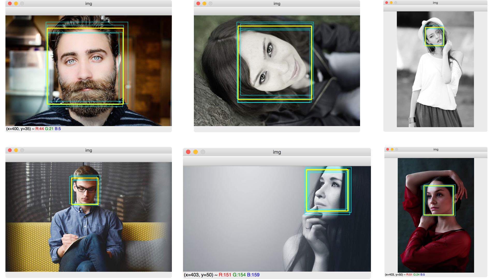

# DNN_detect

This is my study of the detection neural network. I implemented the region proposal net similar to YOLO and FasterRNN. The archtecture of the network is similar to the ResNet.


## Evaluating the trained network
```
python3 dnn_eval.py eval_image
```



The cyan squares are the suggestions from the detection network and the yellow suqare are final output after merging the suggestions into one.

These images are from [Pixabay](https://pixabay.com/)